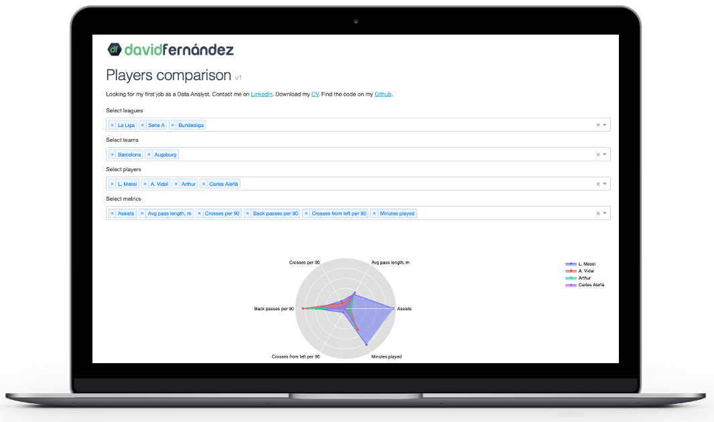

# player-comparator ⚽ 📊

This is my first project using Python after studying some courses on [DataCamp.com](https://www.datacamp.com/tracks/data-scientist-with-python)

I've used a database with random values for each player because I don't have the actual ones.

The user can select multiple players and compare stats in a radar chart. The dashboard is built with Dash and Plotly.

You can find the App here: [davidfernandez.dev](http://davidfernandez.dev). It's deployed on Heroku following [this tutorial](https://dash.plotly.com/deployment).

Contant me on [LinkedIn](https://www.linkedin.com/in/david-fernandez-11a715170/). Looking for my first job as a Data Analyst :)

